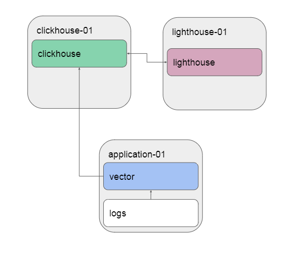

# Ansible Playbook
Данный playbook разворачивает стек из Clickhouse, Lighthouse (на основе nginx) и Vector. Стек позволяет собирать логи и метрики с помощью Vector, отправлять их в БД (Clickhouse), Lighthouse выполняет роль графического интерфейса для Clickhouse.  

Поддерживаются работа на ОС:  
* Red Hat  
* Debian  
* Ubuntu  

### Задачи playbook:
Развернуть стек на трех нодах согласно схеме ниже. Vector собирает демо-логи и отправляет их в БД Clickhouse, Lighthouse позволяет работать с БД в графическом интерфейсе.  

 

### Параметры playbook:  
IP-адреса целевых серверов задаются в inventory/prod.yml

В group_vars можно задать следующие параметры:  
* vector_version - версия Vector
* clickhouse_version - версия ClickHouse
